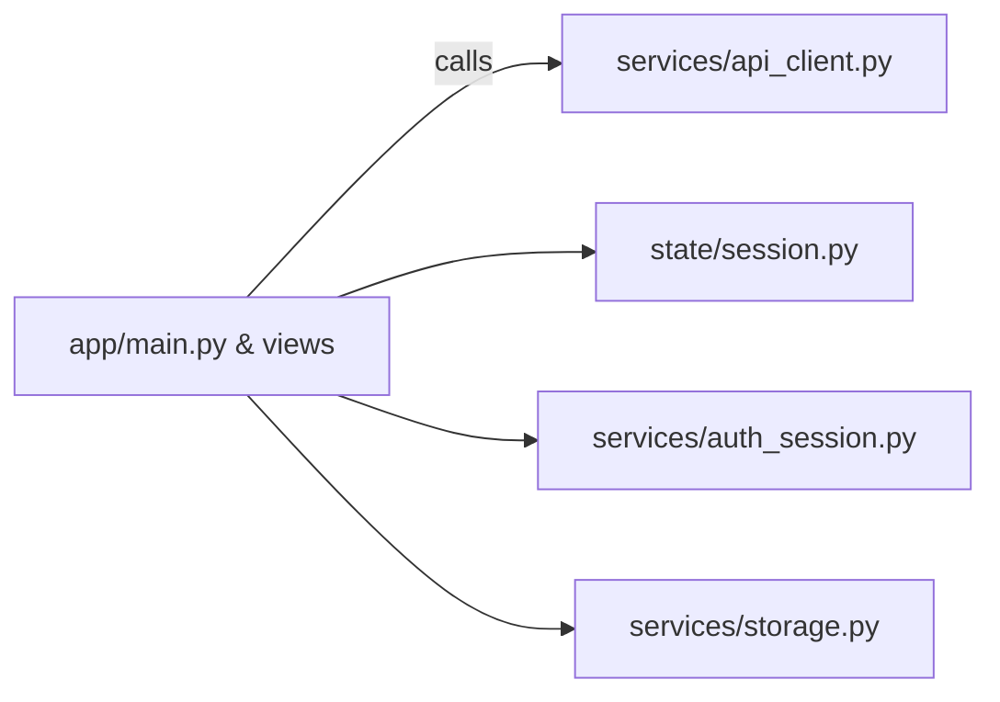

# Streamlit Frontend

Quick Start

```bash
cd frontend/streamlit
python -m venv .venv && source .venv/bin/activate
pip install -r requirements.txt
cp .env.example .env
streamlit run app/main.py --server.port $FRONTEND_PORT
```

```powershell
cd frontend/streamlit
python -m venv .venv ; .\.venv\Scripts\Activate.ps1
pip install -r requirements.txt
copy .env.example .env
streamlit run app/main.py --server.port $env:FRONTEND_PORT
```

Architecture (overview)



- Full docs: docs/INDEX.md

