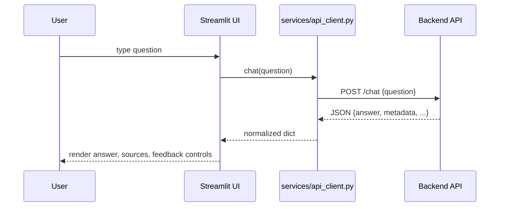
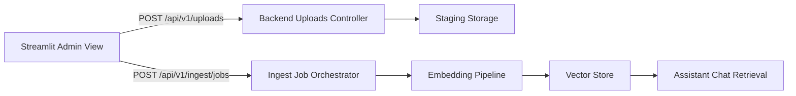

# Architecture

Overview

- Streamlit app that renders a chat UI and a status dashboard, backed by a simple HTTP API client. Local storage is used for users and feedback. Session state orchestrates UI flows.

Modules & Folders

- app/: main entry and views
  - app/main.py: boots app, sidebar auth, navigation, feedback
  - app/views/chat/: chat UI and feedback-on-answer
  - app/views/status/: backend health panel
- state/: session.py initializes keys and helpers
- services/:
  - api_client.py: requests client for backend endpoints
  - auth_session.py: signed cookies (or in-memory fallback)
  - storage.py: users and feedback persistence (JSON/CSV)
- app_config/env.py: loads .env and exposes get_config()
- data/: credentials and feedback folders
- assets/: static files
- artifacts-frontend/: artifacts and inventories
- scripts/: optional helper scripts
- tests/: pytest tests

Startup Flow

```mermaid
flowchart TD
    A[User opens Streamlit app] --> B[app/main.py]
    B --> C[get_config() from app_config/env.py]
    C --> D[init_session() state/session.py]
    D --> E[auth_session.get_cookie_manager()]
    E --> F{Authenticated?}
    F -- no --> G[Sidebar login form]
    F -- yes --> H[Sidebar account + feedback]
    H --> I[Navigate]
    I -- Assistant --> J[app/views/chat]
    I -- Status --> K[app/views/status]
```

Request/Data Flow



Dependency Notes

- Session state (state/session.py) keeps auth flags, chat history, metadata, and ephemeral flags.
- services/api_client.py centralizes HTTP access; responses are normalized for rendering.
- services/auth_session.py provides HMAC-signed tokens saved as cookies (via extra-streamlit-components) or in-memory fallback.
- services/storage.py persists users in data/credentials/usuarios.json and feedback in data/feedback/.

Documents & Embeddings Flow



Quick Links

- Index: ./INDEX.md
- Setup: ./SETUP_AND_RUN.md
