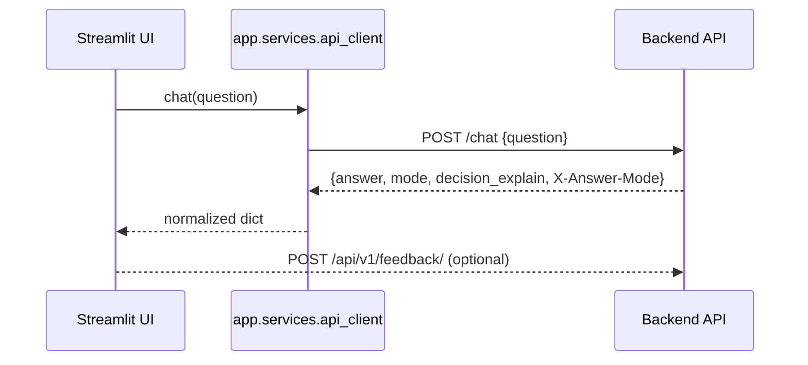

# Architecture
Last updated: 2025-11-07

## Overview
The Streamlit app renders chat, admin dashboards, and feedback tooling against the FastAPI backend. Modules live under `frontend/streamlit/app/` and are namespaced as `app.views.*`, `app.services.*`, and `app.state.*`.

## Modules & Folders
- `app/main.py` – Entry point. Boots Streamlit, loads config, restores cookies, renders sidebar auth + global feedback form, and routes between tabs.
- `app/views/chat/` – Chat UI with rag/hybrid/fallback visualisation. Integrates feedback widgets via `app.services.api_client.send_feedback`.
- `app/views/status/` – Backend health snapshot.
- `app/views/admin/embeddings.py` – Documents & Embeddings admin page (uploads ➜ job creation).
- `app/views/admin/feedback.py` – **Feedback History** with filters, KPIs, and a Q/A table (see below).
- `app/views/users.py` – Admin-only user management.
- `app/components/feedback_table.py` – Shared renderer for the Feedback History table. Shows a combined Q/A column, client/mode badges, and a raw JSON tab when enabled.
- `app/services/*` – HTTP client (`api_client.py`), auth/session helpers, storage shims, feedback helpers. `frontend/streamlit/services/__init__.py` is a compatibility shim—always import from `app.services`.
- `app/state/*` – Feature-specific state managers; e.g., `state/feedback_filters.py` keeps `feedback_filters_*` keys in sync.
- `state/session.py` – Global defaults for `st.session_state` (auth flags, chat history, upload trackers).
- Chat figures: `[FIGURE:<id>]` placeholders in answers render inline thumbnails resolved from `retrieved_chunks_metadata.image_ref` under `RAG_ASSETS_DIR`; a Figures expander remains for fallback/debug.

## Feedback History View
- Location: `app/views/admin/feedback.py`.
- State keys prefixed with `fb_` (`fb_date_from`, `fb_rating`, `fb_admin_raw`, `fb_table`) isolate the feature from other tabs.
- The table combines question and answer preview in a single Q/A column for scanability. Selecting a row opens tabs for “Overview”, “Metadata”, and (when `fb_admin_raw=true`) “Raw JSON”.
- Derived metadata ensures every row exposes `mode`, `client`, `session_id`, `question`, `answer_preview`, and sanitized comments.

## Request/Data Flow


## Startup Flow
```mermaid
flowchart TD
    A[User opens app] --> B[app/main.py]
    B --> C[get_config()]
    C --> D[init_session()]
    D --> E[auth_session.get_cookie_manager()]
    E --> F{Authenticated?}
    F -- no --> G[Sidebar login form]
    F -- yes --> H[Sidebar account + feedback]
    H --> I[Navigate to tab]
```

## Notes
- All backend requests go through `app.services.api_client`. `_auth_headers()` injects `Authorization: Bearer ...` when the user logged in via `/api/v1/auth/login`.
- Admin tabs rely on role `admin`. Non-admins see access-restricted banners.
- Local storage lives under `data/` (users + feedback) and is used only when `AUTH_MODE`/`FEEDBACK_MODE` are `local`.
